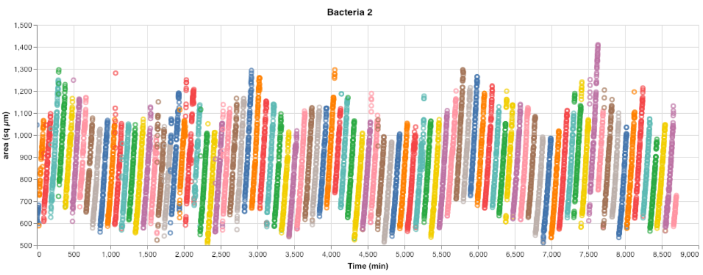
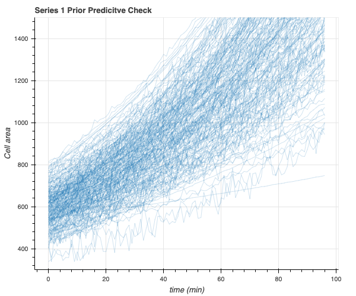
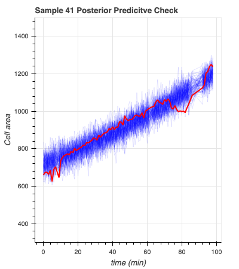
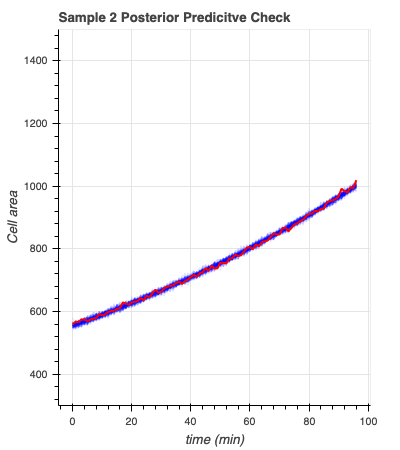
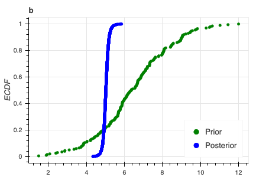

# Biology/Bioengineering 103: Data Analysis for the Biological Sciences
As you might see from perusing these assignments, I love to make beautiful plots! Here are some 
examples from my bayesian modeling-based analysis of whether the growth of a single cell is 
linear or exponential. 
Single cell growth trajectories, extracted from images of a single cell growing in a microfluidics chamber. 

Here I see whether my model produces sensible trajectories before it learns from the data:

Here I see the trajectories my model produces after it learns from the data:

 

Here we see that my prior for one of the growth rate parameters has collapsed to nearly a single 
value in the posterior distribution. this means that the model has learned!

The Akaike weights, which represent the likelihood of a given model, strongly preferred the 
exponential growth model in comparison to the linear model. Thus, even single-cell growth is 
exponential!
